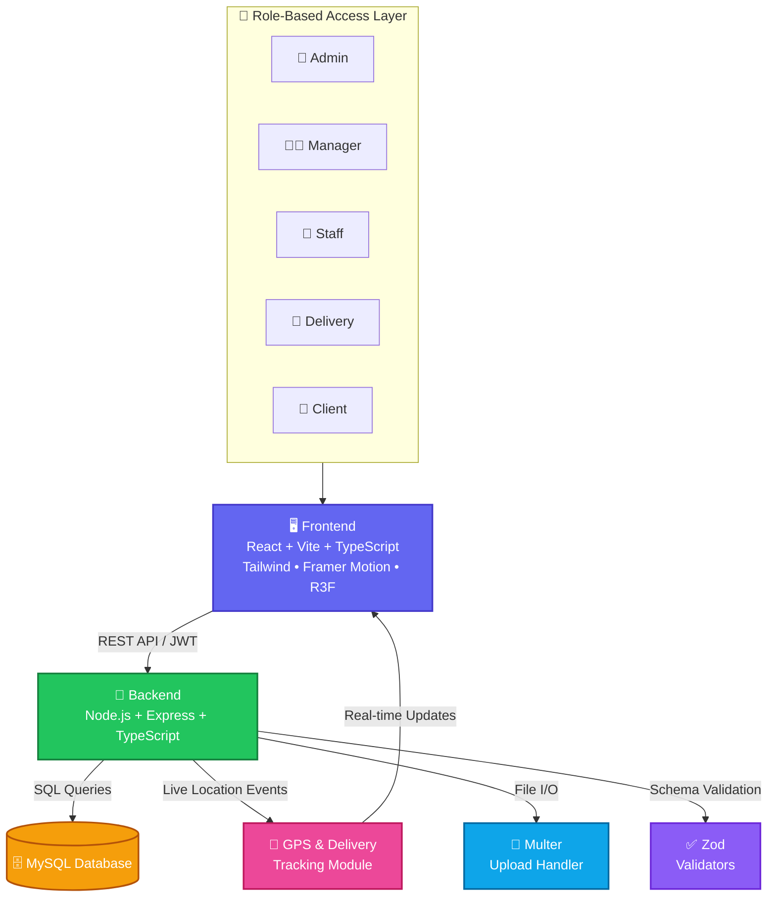
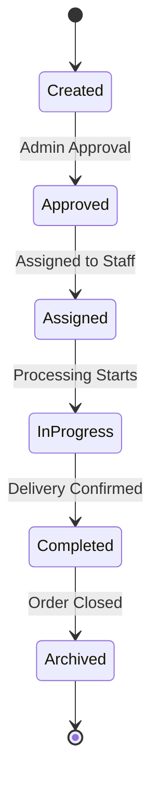

<div align="center">

<!-- Animated typing banner -->
<a href="#">
  
</a>

<br/>


<br/>


</div>

---

## 🌟 Overview

A **modern, full-stack SaaS platform** for managing orders and field services end-to-end — from creation and approval to live GPS-tracked delivery and archival. Built with a scalable architecture, role-based access control, and a beautifully animated UI, this system is designed to feel as good as it performs.

---

## ⚙️ Key Features

| Category | Highlights |
|---|---|
| ⚡ **Real-Time Engine** | Live order lifecycle updates across all connected clients |
| 👥 **Role-Based Access** | Admin, Manager, Staff, Client, and Delivery roles with scoped permissions |
| 📦 **Order Workflow** | `created → approved → assigned → in_progress → completed → archived` |
| 📍 **Live GPS Tracking** | Real-time delivery location + route visualization |
| 📁 **File Management** | Secure upload for PDFs, images, and attachments (Multer) |
| 📊 **Analytics Dashboard** | Interactive charts and insights powered by Recharts |
| 🔐 **Secure Auth** | JWT access + refresh token strategy |
| 🎨 **Modern UI/UX** | TailwindCSS, Framer Motion transitions, React Three Fiber 3D hero |
| 🧠 **Scalable API** | Clean, layered REST architecture (services / validators / utils) |

---

## 🧠 System Architecture



### 🔄 Order Lifecycle Flow



---

## 🛠️ Tech Stack

<table>
<tr>
<td valign="top" width="50%">

### 🎨 Frontend
- ⚛️ React (Vite + TypeScript)
- 💨 TailwindCSS
- 🎬 Framer Motion — smooth animations
- 🧭 React Router
- 📊 Recharts — data visualization
- 🌐 React Three Fiber — 3D landing hero

</td>
<td valign="top" width="50%">

### 🔧 Backend
- 🟢 Node.js + Express
- 🔷 TypeScript
- 🐬 MySQL (mysql2)
- 🔐 JWT Authentication
- 📤 Multer — file uploads
- ✅ Zod — schema validation

</td>
</tr>
</table>

---

## 📁 Project Structure

```
📦 saas-order-management
├── 📂 backend
│   ├── services/       # Business logic layer
│   ├── utils/          # Helper functions
│   └── validators/     # Zod schemas
└── 📂 frontend
    ├── context/         # Global state
    ├── utils/
    └── constants/
```

---

## 🌍 Live Features

- 📍 Real-time delivery GPS tracking
- 🗺️ Route visualization using maps
- 📊 Live analytics dashboard
- 🔔 Instant order status updates

---

## 🎬 UI Highlights

- ✨ Smooth page transitions
- 📊 Animated dashboard cards
- 🌐 3D landing hero (React Three Fiber)
- 📱 Responsive, mobile-first design

---

## 🔑 Demo Login Credentials

| Role | Email | Password |
|---|---|---|
| 👑 Admin | `admin@demo.com` | `Admin@123` |
| 🧑‍💼 Manager | `manager@demo.com` | `Manager@123` |
| 🧑 Staff | `staff@demo.com` | `Staff@123` |
| 🚚 Delivery | `delivery@demo.com` | `Delivery@123` |
| 👤 Client | `client@demo.com` | `Client@123` |

---

## 🚀 Roadmap / Future Enhancements

- 🤖 AI-based demand prediction
- 📱 Mobile app (React Native)
- 💬 Real-time chat between roles
- 🔔 Push notifications
- ☁️ Cloud deployment (AWS / Azure)

---

## 👨‍💻 Developer

<div align="center">

### 🧑‍💻 Biswajit Pattanaik
**Full Stack Developer — SaaS • IoT • Embedded Systems**

*The mind behind this platform's architecture, from database schema to pixel-perfect UI.*

Biswajit brings a rare combination of skills to the table — equally comfortable architecting scalable backend systems as he is fine-tuning microcontrollers on an ESP32. This project reflects that versatility: a production-grade SaaS platform engineered with clean code, thoughtful UX, and real-world reliability in mind. His attention to detail — from role-based security to buttery-smooth UI animations — is what turns a functional app into a genuinely delightful product.

`React` `Node.js` `MySQL` `ESP32` `IoT` `Cloud`

</div>

---

<div align="center">

## ⭐ Support This Project

If this project helped you or inspired your own build:

⭐ **Star** the repository &nbsp;•&nbsp; 🔁 **Share** with fellow developers &nbsp;•&nbsp; 🚀 **Contribute** improvements

<br/>

### 💡 Crafted & Maintained by **Biswajit Pattanaik**


</div>
